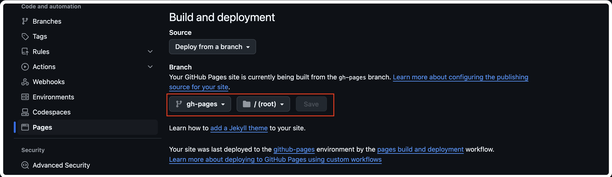

# 3D Room Portfolio Website Template

A modern, interactive portfolio website template built with **React and Three.js**, featuring a 3D room and a file-system-style interface to showcase your work. Easily customize your information and generate a personalized website — **no coding required**.

This repository is a sample version intended for demonstration and ease of use. All content is for illustrative purposes only. Please customize and extend it according to your own needs. Check out a live example at [https://tdbsgng.github.io/](https://tdbsgng.github.io/).
<p align="center">
  
</p>


## 🧩 Features

- **3D environment** rendered in real-time.
- **Interactive components** with different visual and interaction effects.
- **File-system-style interface** to display user information intuitively.

## 🚀 Quickstart

Get the project up and running locally in a few simple steps.

### 🔧 Requirements

Make sure the following tools are installed on your system:

- [Git](https://git-scm.com/)
- [Node.js](https://nodejs.org/)
- [npm](https://www.npmjs.com/)

### 📥 Setup

1. Clone the repository:

   ```bash
   git clone https://github.com/tdbsgng/3d-room-portfolio-website-template.git
   cd 3d-room-portfolio-website-template
   ```

2. Install dependencies:

   ```bash
   npm install
   ```

3. Start the development server:

   ```bash
   npm run dev
   ```

4. Open your browser and navigate to `http://localhost:4000` to view the website.

### Deploy with GitHub Pages

1. **Create a repository named exactly**: `<your-github-username>.github.io`

2. **Run the deploy script**:
   ```bash
   npm run deploy
   ```
3. **Set GitHub Pages source to gh-pages branch**:

- Go to Repository → Settings → Pages (`https://github.com/<your-github-username>/<your-github-username>.github.io/settings/pages`), then:

  - Source: Deploy from a branch
  - Branch: gh-pages

  

4. Wait for a few minutes and the website will be deployed at `https://<your-github-username>.github.io`

## 🛠 Tech Stack

- **React**
- **React Three Fiber**
- **React Three Drei**
- **Three.js**
- **Node.js**
- **Vite**
- **Tailwind CSS**

## 📦 3D Asset Links

Here is the list of all the 3D resources from Sketchfab used in the project:

- **[Room](https://sketchfab.com/3d-models/sci-fi-computer-room-a149d5bfcef6496c9a0606b5ce5ebf27)**
- **[React Logo](https://sketchfab.com/3d-models/react-logo-circle-540ff21ac0f54a038df6f634c7cce726)**
- **[Python Logo](https://sketchfab.com/3d-models/python-8be4a2579dd84586b915068e475073ee)**
- **[C++ Logo](https://sketchfab.com/3d-models/c-1b277fc32bbc451fa6f40e298996ba91)**
- **[Guitar](https://sketchfab.com/3d-models/acoustic-guitar-402aa42f0faa4845878cf005e66a1046)**
- **[Mac](https://sketchfab.com/3d-models/mac-os-2013-2017-macbook-69078d4119eb45f195656f1737dc605b)**
- **[Marshall Bluetooth Speaker](https://sketchfab.com/3d-models/marshall-bluetooth-speaker-1516a73439cb4e4aad74df56fada7cdc)**
